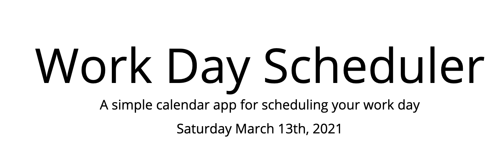
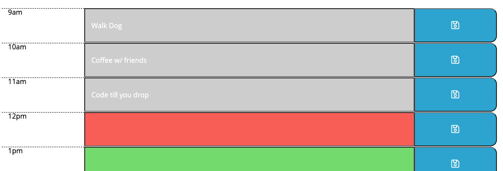
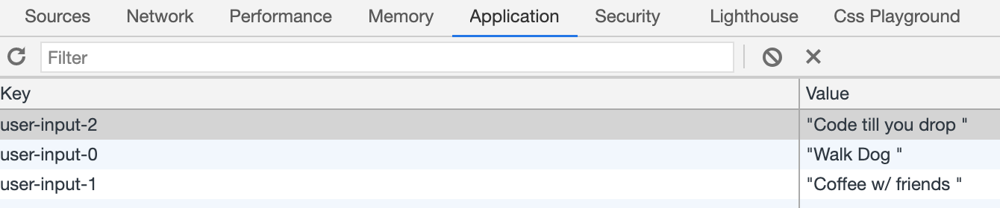

# Day Planner 

## Description

This application allows the user to save events for each hour of the standard workday (9 AM - 5 PM).  

## Usage instructions 
When the user opens the day planer the current date is displayed at the top of the page. 

When the user scrolls down they are presented with time blocks for standard business hours. Each time block is color-coded to indicate whether it is in the past, present, or future. If the user clicks in a time block they can enter an event.

Subsequently, if the user hits the save button next to the event that event is then saved to local storage. 

 

Saved event(s) will persist even if the page is refreshed. 

## Tech 
- HTML
- CSS
- JQuery 
- Bootstrap 
- Moment JS 
- Font Awesome 
- Google Fonts 

## Deployed application
https://doublelforce5.github.io/Day-Planner/

## Contact 
Email: lopez.olivia17@outlook.com

## MIT license
Copyright (c) 2021 Olivia Lopez 

Permission is hereby granted, free of charge, to any person obtaining a copy
of this software and associated documentation files (the "Software"), to deal
in the Software without restriction, including without limitation the rights
to use, copy, modify, merge, publish, distribute, sublicense, and/or sell
copies of the Software, and to permit persons to whom the Software is
furnished to do so, subject to the following conditions:

The above copyright notice and this permission notice shall be included in all
copies or substantial portions of the Software.

THE SOFTWARE IS PROVIDED "AS IS", WITHOUT WARRANTY OF ANY KIND, EXPRESS OR
IMPLIED, INCLUDING BUT NOT LIMITED TO THE WARRANTIES OF MERCHANTABILITY,
FITNESS FOR A PARTICULAR PURPOSE AND NONINFRINGEMENT. IN NO EVENT SHALL THE
AUTHORS OR COPYRIGHT HOLDERS BE LIABLE FOR ANY CLAIM, DAMAGES OR OTHER
LIABILITY, WHETHER IN AN ACTION OF CONTRACT, TORT OR OTHERWISE, ARISING FROM,
OUT OF OR IN CONNECTION WITH THE SOFTWARE OR THE USE OR OTHER DEALINGS IN THE
SOFTWARE.
